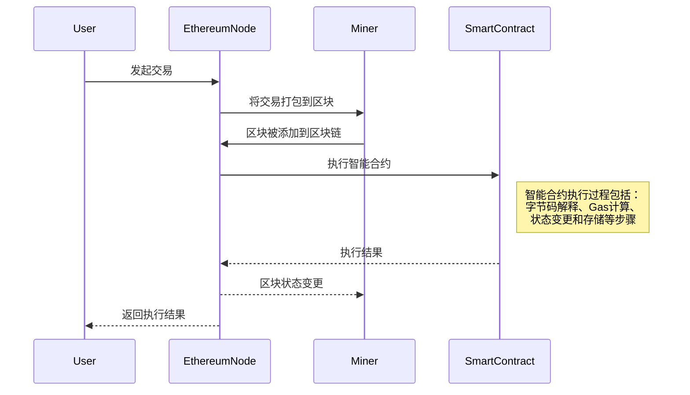

ERC标准

* ERC和EIP的区别

* 标准合约介绍

智能合约的互操和升级

* 互操作方法

* 升级实践

以太坊虚拟机

* 定义和角色
* 智能合约执行
* Gas概念
* 状态存储
* 区块链交互
* 安全性和隔离


### ERC标准

#### ERC和EIP的区别

ERC（Ethereum Request for Comments）是以太坊生态系统中用于制定代币和智能合约接口规范的标准。例如，ERC-20定义了代币标准接口，使不同的代币在以太坊网络上能够一起工作。ERC-721定义了不可替代代币（NFT）的标准接口，使得它们在不同的平台上可互操作。

EIP（Ethereum Improvement Proposal）则是用于提出以太坊网络协议和功能改进的标准。EIP包括协议升级、新功能的引入等。例如，EIP-1559引入了以太坊网络的燃料费改进，改善了交易费用的可预测性和效率。

它们的联系在于，ERC 标准通常是作为 EIP 的一部分提出的，以推动以太坊网络的功能和互操作性的发展。ERC 标准关注智能合约和代币层面，而 EIP 标准关注底层协议和网络功能的改进。它们共同推动了以太坊生态系统的创新和发展。


#### 标准合约介绍

##### ERC-20 

ERC-20 是用于定义代币的标准接口，使得不同代币能够在以太坊网络上相互兼容。它是以太坊上最常见的代币标准之一。

```solidity
// ERC-20 接口定义
interface IERC20 {
    // 查询代币的总供应量
    function totalSupply() external view returns (uint256);

    // 查询指定账户的代币余额
    function balanceOf(address account) external view returns (uint256);

    // 将代币转移到指定账户
    function transfer(address to, uint256 amount) external returns (bool);

    // 查询一个账户允许另一个账户转移的代币数量
    function allowance(address owner, address spender) external view returns (uint256);

    // 授权一个账户可以转移一定数量的代币
    function approve(address spender, uint256 amount) external returns (bool);

    // 由授权的账户转移代币
    function transferFrom(address from, address to, uint256 amount) external returns (bool);

    // 代币转移事件
    event Transfer(address indexed from, address indexed to, uint256 value);

    // 授权事件
    event Approval(address indexed owner, address indexed spender, uint256 value);
}
```

##### ERC-721 

ERC-721 是用于定义不可替代代币（NFT）的标准接口，每个 NFT 都有唯一的标识符

```solidity
// ERC-721 接口定义
interface IERC721 {
    // 查询指定账户拥有的 NFT 数量
    function balanceOf(address owner) external view returns (uint256);

    // 查询指定 NFT 的所有者
    function ownerOf(uint256 tokenId) external view returns (address);

    // 安全地将 NFT 转移到指定账户
    function safeTransferFrom(address from, address to, uint256 tokenId) external;

    // 将 NFT 转移到指定账户
    function transferFrom(address from, address to, uint256 tokenId) external;

    // 授权一个账户可以管理指定 NFT
    function approve(address to, uint256 tokenId) external;

    // 查询被授权管理某个 NFT 的账户
    function getApproved(uint256 tokenId) external view returns (address);

    // 授权一个账户管理所有 NFT
    function setApprovalForAll(address operator, bool approved) external;

    // NFT 转移事件
    event Transfer(address indexed from, address indexed to, uint256 indexed tokenId);

    // NFT 授权事件
    event Approval(address indexed owner, address indexed spender, uint256 indexed tokenId);
}
```

##### ERC-1155 

ERC-1155 是用于定义多功能代币的标准接口，支持一次性创建多个不同类型的代币

```solidity
// ERC-1155 接口定义
interface IERC1155 {
    // 查询指定账户拥有的特定类型代币的数量
    function balanceOf(address account, uint256 id) external view returns (uint256);

    // 批量查询多个账户拥有的代币数量
    function balanceOfBatch(address[] calldata accounts, uint256[] calldata ids) external view returns (uint256[] memory);

    // 授权一个账户管理所有代币
    function setApprovalForAll(address operator, bool approved) external;

    // 安全地将代币转移到指定账户
    function safeTransferFrom(address from, address to, uint256 id, uint256 amount, bytes calldata data) external;

    // 批量安全地将代币转移到指定账户
    function safeBatchTransferFrom(address from, address to, uint256[] calldata ids, uint256[] calldata amounts, bytes calldata data) external;

    // 单个代币转移事件
    event TransferSingle(address indexed operator, address indexed from, address indexed to, uint256 id, uint256 value);

    // 批量代币转移事件
    event TransferBatch(address indexed operator, address indexed from, address indexed to, uint256[] ids, uint256[] values);

    // 代币授权事件
    event ApprovalForAll(address indexed owner, address indexed operator, bool approved);
}
```


### 调用和升级

#### 合约相互调用

##### 函数选择器

函数选择器是 Solidity 中用于唯一标识函数的机制，通过对函数名称和参数类型进行 keccak256 哈希运算生成。每个函数都有一个唯一的函数选择器，确保不同函数有不同的标识。例如，函数 `add(uint256 a, uint256 b)` 的函数选择器是 `keccak256("add(uint256,uint256)")`。在调用合约函数时，以太坊使用函数选择器来确定要执行的具体函数。使用接口时，可以利用函数选择器在编译时进行类型检查，提高代码的安全性和可维护性。


##### 合约调用

合约调用的方式包括通过以太坊交易和在同一合约内部的函数调用两种主要方式。

1. **以太坊交易方式：**
   
   - 创建合约实例：使用合约地址和 ABI 创建合约实例。
   - 构建交易对象：指定目标合约地址、函数选择器以及可能的参数。
   - 发送交易：将交易对象发送到以太坊网络。
   - 燃气费用：此方式会产生燃气费用，需要支付燃气费用以确保交易被矿工确认。
   
   ```javascript
   const contractAddress = "0xContractAddress";
   const abi = [...]; // 合约 ABI
   const contract = new web3.eth.Contract(abi, contractAddress);
   
   // 调用合约函数
   contract.methods.myFunction(arg1, arg2).send({
       from: "0xYourAddress",
       gas: 200000,
   })
   .then((result) => {
       // 处理交易结果
   })
   .catch((error) => {
       // 处理错误
   });
   ```
   
2. **同一合约内部的函数调用方式：**
   - 创建合约实例：通过目标合约的地址创建合约实例。
   - 直接调用函数：调用目标合约的函数，不创建新的以太坊交易。
   - 高效：适用于在同一合约内进行函数调用，不产生额外的燃气费用。

   ```solidity
   // 合约A
   contract ContractA {
       address public contractBAddress;
   
       // 设置合约B的地址
       function setContractBAddress(address _contractBAddress) external {
           contractBAddress = _contractBAddress;
       }
   
       // 合约A调用合约B的函数
       function callContractBFunction() external {
           // 创建合约B的实例
           ContractB contractB = ContractB(contractBAddress);
   
           // 调用合约B的函数
           contractB.exampleFunction();
       }
   }
   ```

总体而言，以太坊交易方式适用于合约之间的外部调用，而同一合约内的函数调用方式更为高效。选择合适的调用方式取决于具体的需求和场景。


#### 合约的升级

##### 合约升级的定义

合约升级是指对智能合约进行修改、更新或升级的过程，旨在改进合约的功能、修复漏洞、适应新的业务需求或提高性能。合约升级可能涉及到修改合约代码、添加新功能、更新合约状态等操作。

##### 常用方法

当涉及到合约升级时，以下是三种常用方法：

**Proxy合约：** 使用代理合约作为中介，将用户请求转发给实际的合约实现。升级时，只需更新代理合约指向新版本的合约，而用户无需感知变化。这种方法提供了灵活性和无缝升级的优势。

**版本管理：** 引入版本管理机制，通过在合约中添加版本号变量或其他标识，清晰标识当前合约的版本。这种方法使得可以在合约中处理不同版本的逻辑，有助于保持兼容性和跟踪升级历史。

**升级模式：** 使用升级模式设计，允许合约逻辑部分进行升级，同时保持状态和存储不变。这可以包括代理模式、存储分离模式等，提供了一种平滑升级的方式。

每种方法都有其优势和适用场景，选择取决于具体的需求和合约的架构。Proxy合约通常被认为是一种灵活而强大的升级方法，而版本管理和升级模式则可以根据项目的具体要求进行选择。


### 以太坊虚拟机

#### 定义和角色

**EVM的定义：**

EVM是以太坊区块链上的虚拟机，负责执行智能合约的字节码。它提供了一个分布式的运行环境，使得智能合约能够在整个以太坊网络上运行，实现去中心化应用（DApp）的逻辑。

**主要角色涉及：**

1. **EVM执行引擎：**
   - EVM执行引擎是EVM的核心组件，负责解释和执行智能合约的字节码。它将字节码转换为机器指令，并管理合约的执行。

2. **智能合约开发者：**
   - 智能合约开发者是编写智能合约代码的人员，使用支持EVM的编程语言（例如Solidity）创建智能合约。开发者通过编写代码来定义合约的逻辑和功能。

3. **以太坊节点：**
   - 以太坊网络中的节点是EVM的宿主，每个节点都包含一个EVM实例。节点接收并验证交易，执行智能合约的代码，并在整个网络中传播执行结果。

4. **用户：**
   - 用户是发起交易和与智能合约进行交互的参与者。用户可以通过发送交易来调用智能合约的函数，触发合约的状态变化。

5. **Gas：**
   - Gas是EVM中的计费单位，用于限制和计量智能合约的执行成本。每个操作都消耗一定数量的Gas，确保网络的稳定和防止滥用。

#### 智能合约执行



上面的流程图描述了EVM中智能合约执行的简要过程：

1. **用户发起交易：** 用户通过向以太坊网络发送交易来请求智能合约执行。

2. **交易被打包：** 矿工从交易池中选择交易，将其打包到新的区块中。

3. **区块被添加到区块链：** 矿工将包含用户交易的区块添加到区块链上。

4. **EVM执行智能合约：** 每个以太坊节点上的EVM开始执行区块中包含的智能合约字节码。执行过程包括字节码解释、Gas计算、状态变更和存储等步骤。

5. **执行结果返回：** 执行结果，例如智能合约的状态变更或返回值，被记录在区块链上，并最终返回给用户。

这个流程图简要概括了用户发起交易到智能合约执行完成的整个过程。
